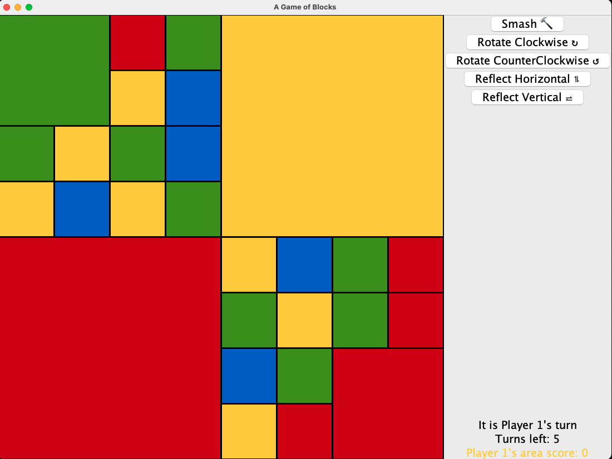

# Block Game

Run `BlockGame` to play.

The game is played on a randomly-generated game board made of squares of four different colors,
such as the following:

## Rules

At the beginning of the game, each player is assigned a randomly-generated goal. There are two
types of goal:

- _Blob goal_. The player must aim to create the largest “blob” of a given color c. A blob is a group
  of orthogonally connected blocks with the same color. That is, two blocks are considered
  connected if their sides touch; touching corners does not count. The player’s score is the
  number of unit cells in the largest blob of color c.

- _Perimeter goal_. The player must aim to put the most possible units of a given color c on the
  outer perimeter of the board. The player’s score is the total number of unit cells of color c
  that are on the perimeter. There is a premium on corner cells: they count twice towards the
  score.

There are three kinds of moves a player can do:

• rotating a block (clockwise or counterclockwise),

• reflecting the block horizontally or vertically (i.e. along the x-axis or the y-axis if you imagine
the origin of the axes being place in the center of the block), and

• “smashing” a block (giving it four brand-new, randomly generated, sub-blocks).

After each move, the player sees their score, determined by how well they have achieved their goal.
The game continues for a certain number of turns, and the player with the highest score at the end
is the winner.

## What's next for Block Game

Different types of goals could be added, or computer players can be implemented so that players can challenge themselves against an AI.
The possibilities are endless ;)
